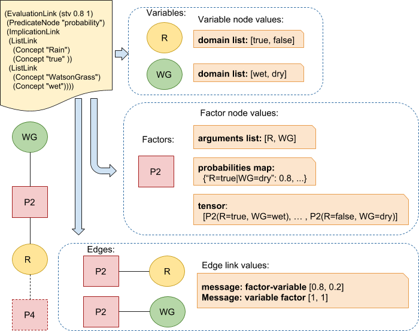
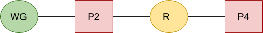

# Belief Propagation algorithm implementation in OpenCog


## Reference Implementation

[Belief Propagation in Python](../opencog/bayesian-network/factor-graph/belief_propagation.py)

[Algorithm and tests folder](../opencog/bayesian-network/factor-graph)

## Bayesian network

Example: Sherlock Holmes and wet grass

HG - grass is wet on Holmes's lawn  
WG - grass is wet on Watson's lawn  
S - sprinkler was turned on  
R - there was a rain


P(HG, WG, S, R) = P(HG|S,R) P(WG|R) P(S) P(R)

Was there a rain if Holmes's grass is wet?

P(R=true|HG=wet) = P(R=true, HG=wet) / P(HG=wet)

P(R=true, HG=wet)  
= Sum[S, WG] P(HG=wet, WG, S, R=true)  
= Sum[S, WG] (P(HG=wet|S, R=true) P(WG|Rain=true) P(S) P(Rain=true))

P(HG=wet)  
= Sum[WG, S, R] P(HG=wet, WG, S, R)  
= Sum[WG, S, R] (P(HG=wet|S, R) P(WG|Rain) P(S) P(Rain))


Was there a rain if Holmes's and Watson's grass is wet?

P(R=true|HG=wet, WG=wet) = P(R=true, HG=wet, WG=wet) / P(HG=wet, WG=wet)

P(R=true, HG=wet, WG=wet)  
= Sum[S] P(HG=wet, WG=wet, S, R=true)  
= Sum[S] (P(HG=wet|S, R=true) P(WG=wet|Rain=true) P(S) P(Rain=true))

P(HG=wet, WG=wet)  
= Sum[S, R] P(HG=wet, WG=wet, S, R)  
= Sum[S, R] (P(HG=wet|S, R) P(WG=wet|Rain) P(S) P(Rain))

## Factorization

Create a bipartite graph where one set of vertices are functions and another set are variables:

P(HG, WG, S, R) = P(HG|S,R) P(WG|R) P(S) * P(R) = P1(HG,S,R) P2(WG,R) P3(S) * P3(R)


## Factor Tree

The algorithm will be used for trees:


## Messages sending on Factor tree

Message from variable i to factor f:  
M(i->f) = Mul[g, g!=f] M (g->i)

Initial message from variable i to factor f for leaf variables:  
M(i->f) = [1, 1, ... , 1]


Message from factor f to variable i:  
M(f->i) = Sum[j, j !=i] f(X) Mul(j, j!=i) M [j->f]

Initial message from factor f to variable i for leaf factors:  
M(i->f) = [f(V1), f(V2), ... , f(Vn)]


## Algorithm Steps

Task solution steps:
1. Define probability values
1. Define evidences
1. Define marginal distributions to calculate
1. Create a factor tree
1. Run Belief Propagation algorithm

### Probability Values

Rain: true, false  
Sprinkler: switch-on, switch-off  
Grass: wet, dry

P(R)

|true |false |
|-----|------|
|  0.2|   0.8|

P(S)

|true |false |
|-----|------|
|  0.1|   0.9|


P(WG|R)

|    R|   wet|       dry|
|-----|------|----------|
|true |1     |         0|
|false|0.2   |       0.8|


P(HG|S, R)

|         S|    R|   wet|       dry|
|----------|-----|------|----------|
|switch-on |true |1     |         0|
|switch-on |false|0.9   |       0.1|
|switch-off|true |1     |         0|
|switch-off|false|0     |         1|

### OpenCog representation

```scheme
; Gras is wet or dry
(InheritanceLink (Concept "wet") (Concept "Grass"))
(InheritanceLink (Concept "dry") (Concept "Grass"))

(InheritanceLink (Concept "HolmesGrass") (Concept "Grass"))

; Probabilities
(EvaluationLink (stv 0.2 1)
 (PredicateNode "probability")
 (AssociativeLink (Concept "Rain") (Concept "true")))

(EvaluationLink (stv 1.0 1)
 (PredicateNode "probability")
 (ImplicationLink
  (AssociativeLink (Concept "Rain") (Concept "true" ))
  (AssociativeLink (Concept "WatsonGrass") (Concept "wet"))))

(EvaluationLink (stv 1.0 1)
 (PredicateNode "probability")
 (ImplicationLink
  (AndLink
   (AssociativeLink (Concept "Sprinkler") (Concept "switch-on" ))
   (AssociativeLink (Concept "Rain") (Concept "true" )))
  (AssociativeLink (Concept "WatsonGrass") (Concept "wet"))))

; Evidences
(EvaluationLink (stv 1.0 1)
 (PredicateNode "evidence")
 (AssociativeLink (Concept "WatsonGrass") (Concept "wet")))

(EvaluationLink (stv 1.0 1)
 (PredicateNode "evidence")
 (AssociativeLink (Concept "HolmesGrass") (Concept "wet")))
```

### Posterior probabilities

Sample:

P(R=true|HG=wet, WG=wet) = P(R=true, HG=wet, WG=wet) / P(HG=wet, WG=wet) 
  = Sum[S] P(HG=wet, WG=wet, S, R=true) / Sum[S, R] P(HG=wet, WG=wet, S, R)

### Marginal probabilities

Two marginal probabilities should be calculated:
* Sum[S] P(HG=wet, WG=wet, S, R=true)  
  HG=wet, WG=wet, and R=true are evidences
* Sum[S, R] P(HG=wet, WG=wet, S, R)  
  HG=wet and WG=wet are evidences

### Belief Propagation algorithm

#### Factor graph data types

Given the probability predicates the following nodes and links are generated:

* Variable nodes
* Factor nodes
* Factor-Variable edge links




Probability predicates:
```scheme
; Probabilities
(EvaluationLink (stv 0.2 1)
 (PredicateNode "probability")
 (AssociativeLink (Concept "Rain") (Concept "true")))

(EvaluationLink (stv 1.0 1)
 (PredicateNode "probability")
 (ImplicationLink
  (AssociativeLink (Concept "Rain") (Concept "true" ))
  (AssociativeLink (Concept "WatsonGrass") (Concept "wet"))))

```

Generated Variable nodes:
```scheme
(Concept "Variable-Rain")
(Concept "Variable-WatsonGrass")
```

Generated Factor nodes:
```scheme
(Concept "Factor-Rain")
(Concept "Factor-Rain-WatsonGrass")
```

Generated edges:
```scheme
(EvaluationLink
 (PredicateNode "graph-edge")
 (ListLink (Concept "Factor-Rain") (Concept "Rain" )))

(EvaluationLink
 (PredicateNode "graph-edge")
 (ListLink (Concept "Factor-Rain-WatsonGrass") (Concept "Rain" )))

(EvaluationLink
 (PredicateNode "graph-edge")
 (ListLink (Concept "Factor-Rain-WatsonGrass") (Concept "WatsonGrass" )))
```

Where graph edge is of the form:
```text
EvaluationLink
  PredicateNode "graph-edge"
  ListLink Factor Variable
```
Edge is always generated from a factor to variable

Each node or link has the following values.

Variable node values:
* domain list

Factor node values:
* arguments list
* probabilities map
* factor tensor

Edge list values:
* message from factor to variable
* message from variable to factor


##### Values description

Variable domain list:
* Each variable V has a domain (v1, ..., vn)
* If there is an evidence for some variable its domain is reduced only to one value.

For example:  
Variable "Rain", domain ["true", "false"]  
Variable "WatsonGrass", domain ["wet", "dry"]

Factor arguments list:
* Each factor contains sorted list of its arguments

For example:  
Factor: "Factor-Rain", arguments: ["Rain"]  
Factor: "Factor-Rain-WatsonGrass", arguments: ["Rain", "WatsonGrass"]

Factor probability map:
* Each factor has a map from list of arguments to probability

For example:  
Factor: "Factor-Rain" map: {"Rain=true": 0.2, "Rain=false": 0.8}  
Factor: "Factor-Rain" map: {"Rain=true|WatsonGrass=wet": 0.9, ... ,"Rain=false|WatsonGrass=dry": 0.7 }

Factor tensor:
* Each factor has a tensor which consists of the factor applied for all permutations of variables values.

For example:  
Factor: "Factor-Rain", tensor: [P2(Rain=true), P2(Rain=false)]  
Factor: "Factor-Rain-WatsonGrass", tensor: [P1(Rain=true,WatsonGrass=wet), ..., P1(Rain=false,WatsonGrass=dry)]

If the factor argument list consists of one variable U the tensor is:
[F(U=u1), ..., F(U=un)]

If the factor argument list consists of two variable U and V the tensor is:  
[[F(U=u1, V=v1), ..., F(U=u1, V=vm)]  
 [F(U=un, V=v1), ..., F(U=un, V=vm)]]

If the factor argument list consists of two variable U, V, and W the tensor is:  
[F(U=ui, V=vj, W=wk)]

Edge messages:
* Message from a variable to a factor
* Message from a a factor to a variable

For example:  
Message from variable "WatsonGrass" to factor "Factor-Rain-WatsonGrass":  
  [1.0, 1.0]  
Message from factor "Factor-Rain" to variable "Rain":  
  [0.8, 0.2]

#### Main algorithm steps

Belief propagation algorithm:

* Initialization (factor graph creation)
  * For each probability predicate
    * Generate Variable nodes
      * Set variable domain
    * Generate Factor nodes
      * Set arguments list
      * Set probabilities map
      * Set factor tensor
    * Generate factor-variable edges
* Main loop until all edges have sent messages
  * For each node
    * For each neighbour node
      * Message sending

Messages sending.

Message from variable i to factor f:
```text
If there is no messages from variable i to f:
  Get a set of edges from factor g to i where g!=f
    If the set is empty, send initial message M(i->f) = [1, ..., 1]
      where the vector size is the size of the variable i domain
    If the set size is number of incoming factors minus 1
        (all connected factors except f have messages to i)
      send componentwise multiplication of the messages
    Else do nothing (not all messages are received)
```

Message from factor f to variable i:
```text
If there is no messages from variable i to f:
  Get set of edges from variable j to factor f where j!=i
    If the set is empty, send initial message M(f->i)=[f(Xi=v1), ..., f(Xi)=vn]
      where the message size is the size of the variable i domain
    If the set size is number of incoming variables minus 1
        (all connected variables except i have messages to f)
      calculate tensor from F from f
        F = (f(X1=v11, X2=v21), ..., f(X1=v1n, X2=v2n))
      multiply the tensor F to all incoming messages except variable i:
      M(f->i)=Sum[k] F * M[k->f] where k!=i
    Else do nothing (not all messages are received)
```

Factor value calculation:
* for the given factor name find factor-argument-list
* for each variable get its domain


#### Simple Grass and Rain sample

Lets take a look at the simplified factor graph there are only Rain and WastsonGrass are present:

Rain: true, false  
WatsonGrass: wet, dry

P(R)

|true |false |
|-----|------|
|  0.2|   0.8|

P(WG|R)

|    R|   wet|       dry|
|-----|------|----------|
|true |0.9   |      0.1 |
|false|0.25  |      0.75|


P(WG, R) = P(WG|R) P(R)



The task is to calculate a probability of rain given grass is wet:

P(R=true|WG=wet) = P(R=true, WG=wet) / P(WG=wet)

"calculate-probability" predicate is used to define the probability in question.
```scheme
(EvaluationLink
 (PredicateNode "calculate-probability")
 (ImplicationLink
  (AssociativeLink (Concept "Grass") (Concept "wet" ))
  (AssociativeLink (Concept "Rain") (Concept "rain"))))
```

The task is split on steps:
* calculate the belief propagation for the numerator
* calculate the belief propagation for the denominator
* divide numerator to denominator

Numerator with the corresponding evidences:
```scheme
(EvaluationLink
 (PredicateNode "beief-propagation-probability")
 (AndLink
  (AssociativeLink (Concept "Grass") (Concept "wet" ))
  (AssociativeLink (Concept "Rain") (Concept "rain"))))

(EvaluationLink
 (PredicateNode "evidence")
  (AssociativeLink (Concept "Grass") (Concept "wet")))

(EvaluationLink
 (PredicateNode "evidence")
  (AssociativeLink (Concept "Rain") (Concept "true")))
```

Denominator with the corresponding evidences:
```scheme
(EvaluationLink
 (PredicateNode "beief-propagation-probability")
  (AssociativeLink (Concept "Grass") (Concept "wet" )))

(EvaluationLink
 (PredicateNode "evidence")
  (AssociativeLink (Concept "Grass") (Concept "wet")))
```

##### Messages

Initial message from variable Watson Grass to factor P2
```scheme
(EvaluationLink
 (PredicateNode "graph-message")
 (AndLink
  (Concept "WatsonGraph")
  (Concept "P2")
  (AndLink (Number "1") (Number "1"))))
```

Initial message from factor P4 to variable Rain
```scheme
(EvaluationLink
 (PredicateNode "graph-message")
 (AndLink
  (Concept "P4")
  (Concept "Rain")
  (AndLink (Number "P4(Rain=false)") (Number "P4(Rain=true)"))))
```

Message from variable Rain to factor P2
```scheme
(EvaluationLink
 (PredicateNode "graph-message")
 (AndLink
  (Concept "Rain")
  (Concept "P2")
  (AndLink (Number "1") (Number "1"))))
```

Message from factor P2 to variable Rain
```scheme
(EvaluationLink
 (PredicateNode "graph-message")
 (AndLink
  (Concept "P2")
  (Concept "Rain")
  (AndLink
   (Number "P2(Rain=false, WatsonGrass=dry) * 1 + P2(Rain=false, WatsonGrass=wet) * 1")
   (Number "P2(Rain=true, WatsonGrass=dry) * 1 + P2(Rain=true, WatsonGrass=wet) * 1"))))
```