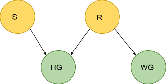
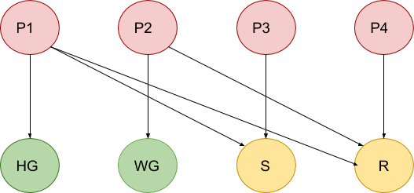
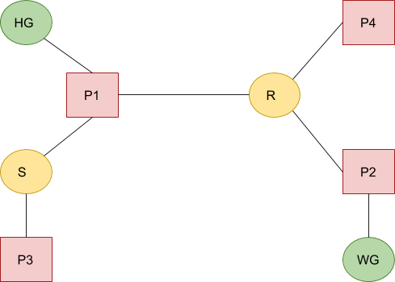
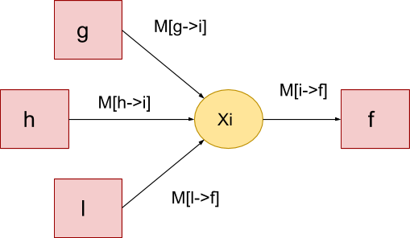
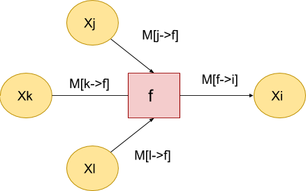

# Belief Propagation algorithm implementation in OpenCog

Example: Sherlock Holmes and wet grass

## Bayesian network

HG - grass is wet on Holmes's lawn  
WG - grass is wet on Watson's lawn  
S - sprinkler was turned on  
R - there was a rain

P(HG, WG, S, R) = P(HG|S,R) P(WG|R)  P(S) * P(R)

P(HG=T|WG=T) = P(HG=T, WG=T) / P(WG=T) = Sum[S,R] P(HG=T, WG=T, S, R) / Sum[HG, S,R] P(HG, WG=T, S, R)

## Factorization

P(HG, WG, S, R) = P(HG|S,R) P(WG|R) P(S) * P(R) = P1(HG,S,R) P2(WG,R) P3(S) * P3(R)

## Factor Tree

## Messages:

Message from node i to factor f:  
M(i->f) = Mul[g, g!=f] M (g->i)

Message from factor f to node i:  
M(f->i) = Sum[j, j !=i] f(X) Mul(j, j!=i) M [j->f]

From node i to factor f:
M(i->f) = [1, 1]

From from factor f to node i:
M(i->f) = [f(False), f(True)]

